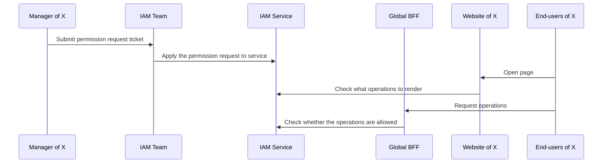
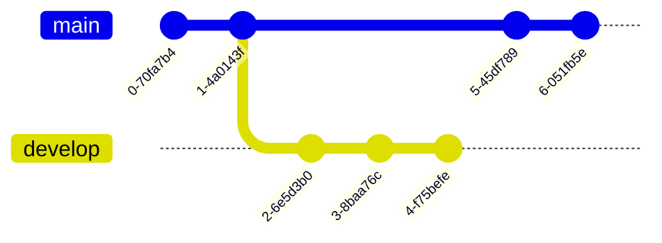
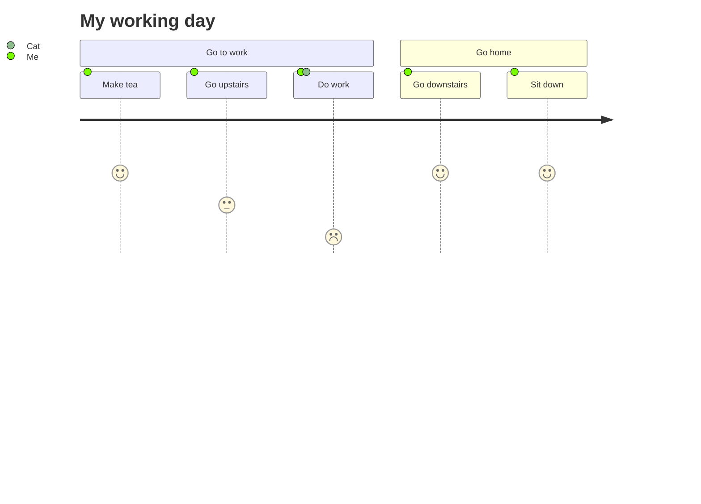

## Horizontal Rules #tag #tag2 #tag3 #tag4 #tag5 #important #complete #inprogress #daily #weekly #monthly #quarterly #yearly #question #idea


---


## **Emphasis** #tag 

#tag8 #tag9

**This is bold text** test

__This is bold text__

*This is italic text*

_This is italic text_

**_This is bold italic text_**

%%test%%

~~Strikethrough~~
```note-notice
test
```

```note-purple-bg
test
```

```note-blue-bg
test
```

```note-pink-bg
test
```

```note-red-bg
test
```

```note-brown-bg
test
```

```note-orange-bg
test
```

```note-green-bg
test
```

```note-yellow-bg
test
```

```note-important
test
```


```note-purple
test
```

```note-blue
test
```

```note-pink
test
```

```note-red
test
```

```note-brown
test
```

```note-orange
test
```

```note-green
test
```

```note-yellow
test
```
## Blockquotes


> Blockquotes can also be nested...
>> ...by using additional greater-than signs right next to each other...
> >  > ...or with spaces between arrows.

## Code

Inline `code`

Indented code

    // Some comments
    line 1 of code
    line 2 of code
    line 3 of code

==~~your words~~==
*==~~your words~~==*
*~~your words~~*


Block code "fences"

```
Sample text here...
```

Syntax highlighting

```python
class ExitNotifyThread(Thread):

    """This class is designed to alert a "monitor" to the fact that a thread has

    exited and to provide for the ability for it to find out why."""

    def run(self):

        global exitthreads, profiledir

        self.threadid = thread.get_ident()

        try:

            if not profiledir:          # normal case

                Thread.run(self)

            else:

                try:

                    import cProfile as profile

                except ImportError:

                    import profile

                prof = profile.Profile()

                try:

                    prof = prof.runctx("Thread.run(self)", globals(), locals())

                except SystemExit:

                    pass

                prof.dump_stats( \

                            profiledir + "/" + str(self.threadid) + "_" + \

                            self.getName() + ".prof")

        except:

            self.setExitCause('EXCEPTION')

            if sys:

                self.setExitException(sys.exc_info()[1])

                tb = traceback.format_exc()

                self.setExitStackTrace(tb)

        else:

            self.setExitCause('NORMAL')

        if not hasattr(self, 'exitmessage'):

            self.setExitMessage(None)

        if exitthreads:

            exitthreads.put(self, True)

    def setExitCause(self, cause):

        self.exitcause = cause

    def getExitCause(self):

        """Returns the cause of the exit, one of:

        'EXCEPTION' -- the thread aborted because of an exception

        'NORMAL' -- normal termination."""

        return self.exitcause

    def setExitException(self, exc):

        self.exitexception = exc

    def getExitException(self):

        """If getExitCause() is 'EXCEPTION', holds the value from

        sys.exc_info()[1] for this exception."""

        return self.exitexception

    def setExitStackTrace(self, st):

        self.exitstacktrace = st

    def getExitStackTrace(self):

        """If getExitCause() is 'EXCEPTION', returns a string representing

        the stack trace for this exception."""

        return self.exitstacktrace

    def setExitMessage(self, msg):

        """Sets the exit message to be fetched by a subsequent call to

        getExitMessage.  This message may be any object or type except

        None."""

        self.exitmessage = msg

    def getExitMessage(self):

        """For any exit cause, returns the message previously set by

        a call to setExitMessage(), or None if there was no such message

        set."""

        return self.exitmessage
```

``` ts
let letNumber = 10;
const constNumber = 20;

const bool: boolean = true;
const list: number[] = [1, 2, 3];
const array: Array<number> = [1, 2, 3];
const pair: [string, number] = ['hello', 10];

for (let i = 0; i < list.length; i += 1) {
  console.log(list[i]);
}

if (bool) {
  console.log('True');
} else {
  console.log('False');
}

const str: string = 'Jake';
const templateStr: string = `Hello, ${str}!`;

// A comment

/*
 * Multiline comments
 * Multiline comments
 */

interface SquareConfig {
  label: string;
  color?: string;
  width?: number;
  [propName: string]: any;
}

interface SearchFunc {
  (source: string, subString: string): boolean;
}

enum Color {
  Red,
  Green,
}

type Easing = "ease-in" | "ease-out" | "ease-in-out";

class Greeter {
  private readonly greeting: string;

  constructor(message: string) {
    this.greeting = message;
  }

  greet() {
    return "Hello, " + this.greeting;
  }
}

let greeter = new Greeter("world");

class Animal {
  move(distanceInMeters: number = 0) {
    console.log(`Animal moved ${distanceInMeters}m.`);
  }
}

class Dog extends Animal {
  bark() {
    console.log("Woof! Woof!");
  }
}

const dog = new Dog();
dog.bark();
dog.move(10);
dog.bark();

class Point {
  x: number;
  y: number;
}

interface Point3d extends Point {
  z: number;
}

let point3d: Point3d = { x: 1, y: 2, z: 3 };

function add(x, y) {
  return x + y;
}

let myAdd = function (x, y) {
  return x + y;
};

(function () {
  console.log('IIFE');
}());

function identity<T>(arg: T): T {
  return arg;
}

let myIdentity: <T>(arg: T) => T = identity;

class GenericNumber<T> {
  zeroValue: T;
  add: (x: T, y: T) => T;
}
```

```java
import java.util.Map;

import java.util.TreeSet;

public class GetEnv {

  /**

   * let's test generics

   * @param args the command line arguments

   */

  public static void main(String[] args) {

    // get a map of environment variables

    Map<String, String> env = System.getenv();

    // build a sorted set out of the keys and iterate

    for(String k: new TreeSet<String>(env.keySet())) {

      System.out.printf("%s = %s\n", k, env.get(k));

    }

  }    }
```

```bash
  

#!/bin/bash

cd $ROOT_DIR

DOT_FILES="lastpass weechat ssh Xauthority"

for dotfile in $DOT_FILES; do conform_link "$DATA_DIR/$dotfile" ".$dotfile"; done

# TODO: refactor with suffix variables (or common cron values)

case "$PLATFORM" in

    linux)

        #conform_link "$CONF_DIR/shell/zshenv" ".zshenv"

        crontab -l > $ROOT_DIR/tmp/crontab-conflict-arch

        cd $ROOT_DIR/$CONF_DIR/cron

        if [[ "$(diff ~/tmp/crontab-conflict-arch crontab-current-arch)" == ""

            ]];

            then # no difference with current backup

                logger "$LOG_PREFIX: crontab live settings match stored "\

                    "settings; no restore required"

                rm ~/tmp/crontab-conflict-arch

            else # current crontab settings in file do not match live settings

                crontab $ROOT_DIR/$CONF_DIR/cron/crontab-current-arch

                logger "$LOG_PREFIX: crontab stored settings conflict with "\

                    "live settings; stored settings restored. "\

                    "Previous settings recorded in ~/tmp/crontab-conflict-arch."

        fi

    ;;
```

## Tables

| Option | Description |
| ------ | ----------- |
| data   | path to data files to supply the data that will be passed into templates. |
| engine | engine to be used for processing templates. Handlebars is the default. |
| ext    | extension to be used for dest files. |

Right aligned columns

| Option | Description |
| ------:| -----------:|
| data   | path to data files to supply the data that will be passed into templates. |
| engine | engine to be used for processing templates. Handlebars is the default. |
| ext    | extension to be used for dest files. |


## Links

[link text](http://dev.nodeca.com)

[link with title](http://nodeca.github.io/pica/demo/ "title text!")

Autoconverted link https://github.com/nodeca/pica (enable linkify to see)

[[README]]

[[unresolved]]

## Images


Like links, Images also have a footnote style syntax

![Alt text][id]

With a reference later in the document defining the URL location:

[id]: https://octodex.github.com/images/dojocat.jpg  "The Dojocat"


## Plugins

The killer feature of `markdown-it` is very effective support of
[syntax plugins](https://www.npmjs.org/browse/keyword/markdown-it-plugin).


### [Emojies](https://github.com/markdown-it/markdown-it-emoji)

> Classic markup: :wink: :cry: 🥲 :laughing: :yum: 
>
> Shortcuts (emoticons): :-) :-( 8-) ;)

see [how to change output](https://github.com/markdown-it/markdown-it-emoji#change-output) with twemoji.


### [Subscript](https://github.com/markdown-it/markdown-it-sub) / [Superscript](https://github.com/markdown-it/markdown-it-sup)

- 19^th^
- H~2~O


### [\<ins>](https://github.com/markdown-it/markdown-it-ins)

++Inserted text++


### [\<mark>](https://github.com/markdown-it/markdown-it-mark)

==Marked text==


### [Footnotes](https://github.com/markdown-it/markdown-it-footnote)

Footnote 1 link[^first].

Footnote 2 link[^second].

Inline footnote^[Text of inline footnote] definition.

Duplicated footnote reference[^second].

[^first]: Footnote **can have markup**

    and multiple paragraphs.

[^second]: Footnote text.


### [Definition lists](https://github.com/markdown-it/markdown-it-deflist)

Term 1

:   Definition 1
with lazy continuation.

Term 2 with *inline markup*

:   Definition 2

        { some code, part of Definition 2 }

    Third paragraph of definition 2.

_Compact style:_

Term 1
  ~ Definition 1

Term 2
  ~ Definition 2a
  ~ Definition 2b


### [Abbreviations](https://github.com/markdown-it/markdown-it-abbr)

This is HTML abbreviation example.

It converts "HTML", but keep intact partial entries like "xxxHTMLyyy" and so on.

*[HTML]: Hyper Text Markup Language









> [!noicon blank] Title
> - [ ] test
> - [ ] test
> - [ ] test
> - [ ] test
> - [ ] test

> [!noicon] no icon
> - [ ] test

> [!noborder] no border
> - [ ] test

> [!bookinfo] Title
> 

> [!tip] Title
> Contents

> [!info] Title
> Contents

> [!fail] Title
> Contents

> [!hibox] Title
> Contents

> [!success]
> test

> [!caution] Title
> Contents

> [!question] question
> Contents


```dataview
LIST L.text
FROM "/"
FLATTEN file.lists as L
SORT file.name DESC
```